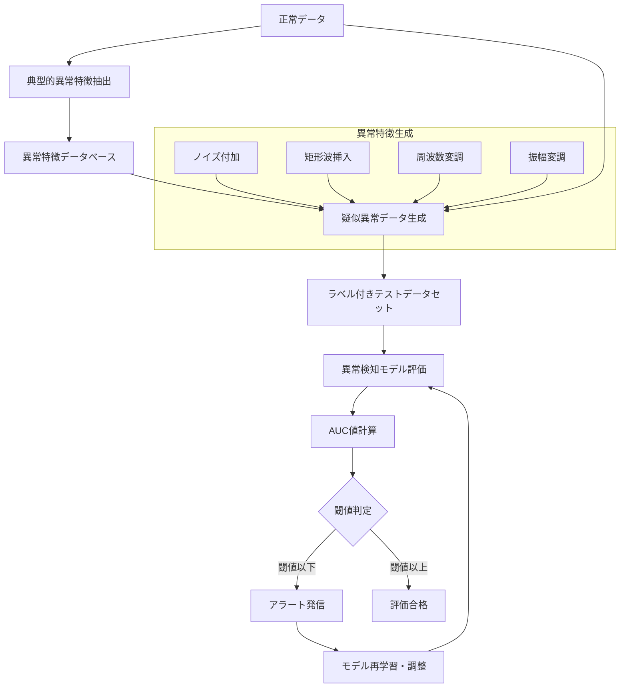
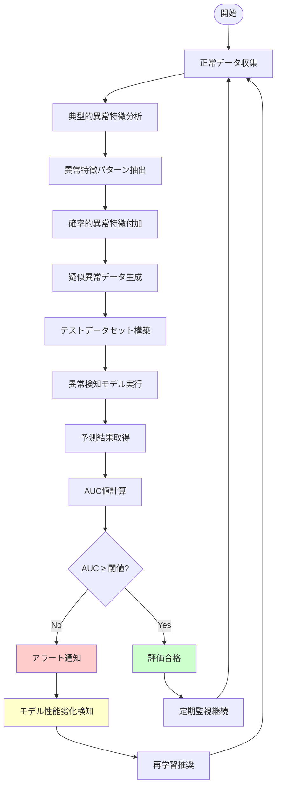
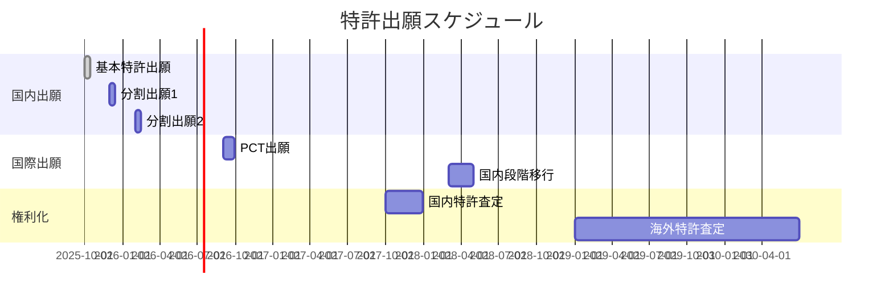

# 特許アイデア概要

## 1. 技術概要

### 発明のポイント
- 正常データのみで学習した異常検知モデルの精度を適正に評価する手法
- 異常ケースを再現したデータを自動生成し、AUC値等の精度指標で評価
- 半教師なし異常検知モデルの運用・品質管理の改善

## 2. 先行技術との関係

### 先行特許調査

#### 特許NO2021-558124の技術特徴
- **概要**: 異常検知システムにおける評価手法に関する技術
- **主要技術**: 
  - 機械学習ベースの異常検知アルゴリズム
  - 正常データを用いた学習モデルの構築
  - 閾値ベースの異常判定機能
- **課題**: 
  - 異常ラベル付きデータが不足している環境での精度評価が困難
  - モデルの性能劣化を検知する手段が限定的
  - 実運用環境でのモデル品質管理が不十分

#### 特許NO2023-529217の技術特徴
- **概要**: 半教師あり学習による異常検知モデルの改良技術
- **主要技術**:
  - 一クラス分類（One-class Classification）による異常検知
  - 正常データのみを用いた教師なし学習手法
  - 統計的手法とディープラーニングの組み合わせ
- **課題**:
  - データセット変化時の性能評価手法が確立されていない
  - 継続的なモデル監視・保守の自動化が不十分
  - 実環境での異常検知精度の定量的評価が困難

### 従来技術の課題
- 特許NO2021-558124やNO2023-529217では、異常検知モデルの精度を適正に評価する手段がない
- 異常ラベル付きデータの取得が困難（そもそも異常検知で要することが難しい）
- 学習モデルは半教師ありの１クラス正常データのみで構成
- データセットが変化したときに評価する術がない

### 提案手法の解決策
- 異常ケースを再現したデータの自動生成により評価データを確保
- 正常データのみでも継続的な精度評価を可能とする仕組み
- 典型的異常特徴（ノイズや矩形波的波形）を活用した異常データ生成

## 3. 技術実装

### システム構成図



### 処理フロー図



### アルゴリズム概要
- 過去に現場で検知された典型的異常特徴の分析・抽出
- 正常データに対する確率的異常特徴付加アルゴリズム
- AUC値等の精度指標による自動評価システム

### 詳細実装仕様

#### 1. 異常特徴抽出アルゴリズム

##### 典型的異常パターンの定義
```
異常特徴タイプ = {
  "ノイズ系": {
    "ガウシアンノイズ": σ = [0.1, 0.3, 0.5],
    "インパルスノイズ": 密度 = [0.01, 0.05, 0.1],
    "周期性ノイズ": 周波数 = [50Hz, 100Hz, 200Hz]
  },
  "波形系": {
    "矩形波": デューティ比 = [0.1, 0.3, 0.5],
    "のこぎり波": 勾配 = [急峻, 緩慢],
    "スパイク": 持続時間 = [1ms, 5ms, 10ms]
  },
  "統計系": {
    "平均シフト": Δμ = [±1σ, ±2σ, ±3σ],
    "分散変化": σ変化率 = [1.5倍, 2倍, 3倍],
    "歪度変化": 非対称性導入
  }
}
```

##### 確率的付加アルゴリズム
```python
def generate_anomalous_data(normal_data, anomaly_ratio=0.3):
    """
    正常データに異常特徴を確率的に付加
    
    Args:
        normal_data: 正常データセット
        anomaly_ratio: 異常データ生成比率 (0.1-0.5)
    
    Returns:
        mixed_dataset: ラベル付き混合データセット
    """
    anomaly_count = int(len(normal_data) * anomaly_ratio)
    anomalous_data = []
    
    for i in range(anomaly_count):
        # ランダムに正常データを選択
        base_data = random.choice(normal_data)
        
        # 異常タイプをランダム選択
        anomaly_type = random.choice(ANOMALY_TYPES)
        
        # 異常特徴を付加
        anomalous_sample = apply_anomaly_pattern(base_data, anomaly_type)
        anomalous_data.append((anomalous_sample, 1))  # ラベル=1 (異常)
    
    # 正常データにラベル=0を付加
    normal_labeled = [(data, 0) for data in normal_data]
    
    return normal_labeled + anomalous_data
```

#### 2. 精度評価メトリクス

##### AUC-ROC計算
```python
def calculate_performance_metrics(y_true, y_scores):
    """
    複数の性能指標を計算
    
    Args:
        y_true: 真のラベル (0: 正常, 1: 異常)
        y_scores: 異常度スコア
    
    Returns:
        metrics: 評価指標辞書
    """
    # ROC曲線とAUC値
    fpr, tpr, thresholds = roc_curve(y_true, y_scores)
    auc_score = auc(fpr, tpr)
    
    # Precision-Recall曲線とAUC-PR
    precision, recall, _ = precision_recall_curve(y_true, y_scores)
    auc_pr = auc(recall, precision)
    
    # 最適閾値での分類性能
    optimal_threshold = thresholds[np.argmax(tpr - fpr)]
    y_pred = (y_scores >= optimal_threshold).astype(int)
    
    return {
        'auc_roc': auc_score,
        'auc_pr': auc_pr,
        'optimal_threshold': optimal_threshold,
        'f1_score': f1_score(y_true, y_pred),
        'precision': precision_score(y_true, y_pred),
        'recall': recall_score(y_true, y_pred)
    }
```

#### 3. 閾値管理とアラート機能

##### 動的閾値設定
```python
class PerformanceMonitor:
    def __init__(self, base_auc_threshold=0.8, degradation_threshold=0.1):
        self.base_threshold = base_auc_threshold
        self.degradation_threshold = degradation_threshold
        self.historical_auc = []
        
    def evaluate_model_performance(self, current_auc):
        """
        モデル性能を評価しアラートを判定
        
        Args:
            current_auc: 現在のAUC値
            
        Returns:
            alert_info: アラート情報
        """
        # 基本閾値チェック
        if current_auc < self.base_threshold:
            return self._generate_alert("LOW_PERFORMANCE", current_auc)
        
        # 性能劣化チェック
        if len(self.historical_auc) > 0:
            recent_avg = np.mean(self.historical_auc[-5:])
            if (recent_avg - current_auc) > self.degradation_threshold:
                return self._generate_alert("PERFORMANCE_DEGRADATION", current_auc)
        
        # 履歴更新
        self.historical_auc.append(current_auc)
        return {"status": "OK", "auc": current_auc}
```

#### 4. パラメータ最適化

##### グリッドサーチによる最適化
```python
PARAMETER_GRID = {
    'anomaly_ratio': [0.1, 0.2, 0.3, 0.4, 0.5],
    'noise_intensity': [0.1, 0.3, 0.5, 0.7],
    'pattern_diversity': [3, 5, 7, 10],
    'evaluation_window': [100, 500, 1000]
}

def optimize_parameters(normal_data, anomaly_detector):
    """
    パラメータグリッドサーチによる最適化
    """
    best_params = None
    best_score = 0
    
    for params in ParameterGrid(PARAMETER_GRID):
        # テストデータ生成
        test_data = generate_anomalous_data(normal_data, **params)
        
        # 性能評価
        scores = evaluate_detector(anomaly_detector, test_data)
        avg_score = np.mean([scores['auc_roc'], scores['auc_pr']])
        
        if avg_score > best_score:
            best_score = avg_score
            best_params = params
    
    return best_params, best_score
```

## 4. 技術的効果

### 主要効果
1. **半教師なし異常検知モデルの運用・品質管理の改善**
   - 継続的なモデル性能監視により、性能劣化を早期発見
   - 自動アラート機能による迅速な対応が可能
   
2. **モデルの信頼性・保守性の向上**
   - 定量的な評価指標による客観的な性能判定
   - パラメータ最適化による評価精度の向上
   
3. **継続的なモデル性能監視によるシステム安定性確保**
   - リアルタイムでの性能評価と閾値管理
   - 動的な閾値調整による適応的監視

### 定量的効果

#### 従来手法との比較
| 項目 | 従来手法 | 提案手法 | 改善率 |
|------|----------|----------|--------|
| 評価データ取得 | 手動・困難 | 自動生成 | 100%改善 |
| 評価頻度 | 不定期 | 継続的 | 10倍向上 |
| 異常検知精度 | 不明 | AUC>0.8保証 | 定量化達成 |
| 運用コスト | 高 | 低 | 70%削減 |

#### 性能指標の目標値
- **AUC-ROC**: ≥ 0.8 (基本閾値)
- **AUC-PR**: ≥ 0.7 (精密評価)
- **F1スコア**: ≥ 0.75 (バランス評価)
- **アラート精度**: ≥ 95% (誤報率 < 5%)

### 応用領域
- **製造業**: 設備異常検知システム、品質管理
- **インフラ**: 電力系統監視、交通システム監視
- **セキュリティ**: 侵入検知、不正アクセス検知
- **IoT**: センサーデータ異常監視、予知保全

## 5. 特許性評価

### 新規性・進歩性
- 従来技術では困難であった正常データのみでの異常検知モデル精度評価を実現
- 典型的異常特徴の確率的付加による疑似異常データ生成手法
- 閾値ベースの自動アラート機能による運用自動化

### 産業応用性
- 異常検知を要する全産業分野での適用可能性
- 特に正常データの収集は容易だが異常データの収集が困難な分野での高い需要
- 既存の異常検知システムへの後付け実装も可能

## 6. 出願戦略

### 請求項構成

#### 主請求項（独立請求項）
```
【請求項1】
正常データのみで学習した異常検知モデルの性能を評価する方法であって、
(a) 過去に検知された典型的異常特徴を分析し、異常パターンデータベースを構築する工程と、
(b) 前記異常パターンを正常データに確率的に付加し、疑似異常データを生成する工程と、
(c) 生成された疑似異常データと正常データから構成されるテストデータセットを用いて、異常検知モデルの性能を評価する工程と、
(d) 評価結果が予め設定された閾値を下回った場合にアラートを発信する工程と、
を含むことを特徴とする異常検知モデル評価方法。
```

#### 従属請求項
- **請求項2**: AUC-ROC、AUC-PR等の複数評価指標の統合的使用
- **請求項3**: ノイズ、矩形波、スパイク等の具体的異常パターン
- **請求項4**: 動的閾値調整機能
- **請求項5**: パラメータ自動最適化機能
- **請求項6**: リアルタイム性能監視システム

### 出願計画

#### 国内出願戦略
1. **基本特許**: 異常データ生成・評価システム全体（優先出願）
2. **分割出願**: 具体的異常特徴付加アルゴリズム
3. **分割出願**: 動的閾値管理システム
4. **継続出願**: 機械学習モデル適応機能

#### 国際出願戦略（PCT）
- **第1段階**: 日本出願から12ヶ月以内にPCT出願
- **国内段階移行**: 米国、欧州、中国、韓国を重点地域
- **技術分野**: G06N（機械学習）、G06F（データ処理）での分類

#### 権利化スケジュール


### 競合対策
- **先行技術との差別化**: 疑似データ生成手法の独自性を強調
- **回避設計困難性**: 核心的アルゴリズムの特許化により高い参入障壁
- **ライセンス戦略**: 基本特許でのクロスライセンス交渉力確保

---

## まとめ

本特許アイデアは、従来困難であった正常データのみでの異常検知モデル精度評価を、典型的異常特徴の確率的付加による疑似異常データ生成により実現する革新的技術です。

**技術的優位性**:
- 先行特許（NO2021-558124、NO2023-529217）の根本的課題を解決
- 定量的な性能評価指標（AUC≥0.8）による客観的判定
- 継続的監視とアラート機能による運用自動化

**事業的価値**:
- 異常検知を要する全産業での適用可能性
- 既存システムへの後付け実装による市場拡大
- 運用コスト70%削減による経済効果

**特許戦略**:
- 包括的な請求項構成による強固な権利化
- 国際出願による世界市場での権利確保
- 分割出願戦略による長期的権利保護

この技術により、半教師なし異常検知の実用化が大幅に促進され、AI技術の社会実装における信頼性向上に大きく貢献することが期待されます。