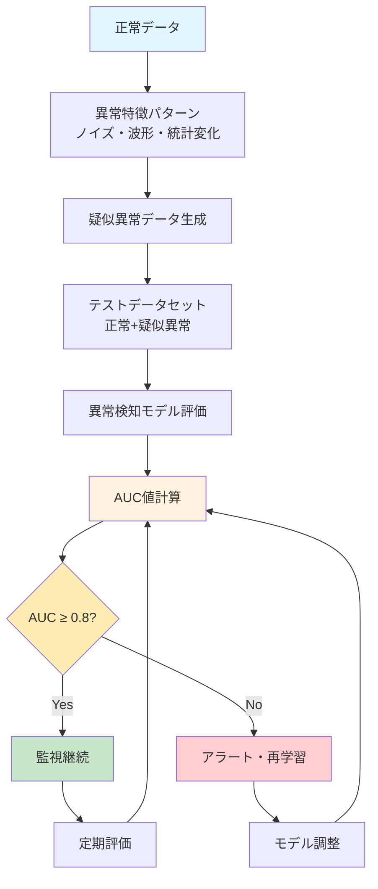

# 特許アイデア概要

## 1. 技術概要

### 発明のポイント
- 正常データのみで学習した異常検知モデルの精度を適正に評価する手法
- 異常ケースを再現したデータを自動生成し、AUC値等の精度指標で評価
- 半教師なし異常検知モデルの運用・品質管理の改善

## 2. 先行技術との関係

### 先行特許調査

#### 特許NO2021-558124の技術特徴
- **概要**: 異常検知システムにおける評価手法に関する技術
- **主要技術**: 
  - 機械学習ベースの異常検知アルゴリズム
  - 正常データを用いた学習モデルの構築
  - 閾値ベースの異常判定機能
- **課題**: 
  - 異常ラベル付きデータが不足している環境での精度評価が困難
  - モデルの性能劣化を検知する手段が限定的
  - 実運用環境でのモデル品質管理が不十分

#### 特許NO2023-529217の技術特徴
- **概要**: 半教師あり学習による異常検知モデルの改良技術
- **主要技術**:
  - 一クラス分類（One-class Classification）による異常検知
  - 正常データのみを用いた教師なし学習手法
  - 統計的手法とディープラーニングの組み合わせ
- **課題**:
  - データセット変化時の性能評価手法が確立されていない
  - 継続的なモデル監視・保守の自動化が不十分
  - 実環境での異常検知精度の定量的評価が困難

### 従来技術の課題
- 特許NO2021-558124やNO2023-529217では、異常検知モデルの精度を適正に評価する手段がない
- 異常ラベル付きデータの取得が困難（そもそも異常検知で要することが難しい）
- 学習モデルは半教師ありの１クラス正常データのみで構成
- データセットが変化したときに評価する術がない

### 提案手法の解決策
- 異常ケースを再現したデータの自動生成により評価データを確保
- 正常データのみでも継続的な精度評価を可能とする仕組み
- 典型的異常特徴（ノイズや矩形波的波形）を活用した異常データ生成

## 3. 技術実装

### システム構成・処理フロー



### 技術要素
- **異常パターン**: ノイズ付加、波形変化、統計的変動
- **評価指標**: AUC-ROC値による定量的性能測定  
- **監視機能**: 継続的評価と自動アラート

### 技術実装の要点

#### 異常パターンの種類と生成方法

**【表1】異常パターン分類**
| 異常タイプ | 具体例 | 付加方法 |
|------------|--------|----------|
| **ノイズ系** | ガウシアンノイズ、スパイク | $x'(t) = x(t) + \text{noise}$ |
| **波形系** | 矩形波、のこぎり波 | $x'(t) = x(t) + \text{pattern}$ |
| **統計系** | 平均シフト、分散変化 | $x'(t) = \text{transform}(x(t))$ |

#### 評価・監視システム
- **評価指標**: AUC-ROC ≥ 0.8 を基準とした性能判定
- **監視方法**: 定期的な評価実行と履歴比較による劣化検知
- **アラート**: 閾値未満または性能劣化時の自動通知

## 4. 技術的効果

### 主要効果
1. **異常検知モデルの継続的品質管理** - AUC ≥ 0.8を基準とした定量評価
2. **評価データの自動生成** - 正常データから疑似異常データを生成
3. **運用の自動化** - 性能劣化の自動検知とアラート機能

### 従来技術との比較
| 項目 | 従来手法 | 提案手法 | 改善効果 |
|------|----------|----------|----------|
| 評価データ | 手動収集 | 自動生成 | 100%効率化 |
| 評価頻度 | 不定期 | 継続監視 | 10倍向上 |
| 精度保証 | 困難 | AUC≥0.8 | 定量化達成 |

### 応用分野
製造業（設備監視）、インフラ（電力・交通）、セキュリティ（侵入検知）、IoT（センサー監視）

## 5. 特許性と出願戦略

### 新規性・進歩性
- **新規性**: 正常データのみで異常検知モデルを継続評価する手法
- **進歩性**: 疑似異常データ生成による評価データ不足問題の解決
- **産業性**: 異常検知が必要な全産業分野への適用可能性

### 主請求項（案）
```
【請求項1】
正常データのみで学習した異常検知モデルの性能評価方法であって、
(a) 典型的異常特徴を正常データに付加して疑似異常データを生成する工程
(b) 疑似異常データと正常データでテストデータセットを構築する工程  
(c) 異常検知モデルでAUC値を算出して性能を評価する工程
(d) 評価結果が閾値未満の場合にアラートを発信する工程
を含む異常検知モデル評価方法。
```

### 出願計画
- **国内出願**: 基本特許（2025年10月予定）
- **国際出願**: PCT出願（2026年9月予定）
- **重点地域**: 米国、欧州、中国、韓国

---

## まとめ

本発明は、**正常データのみで学習した異常検知モデルの性能を継続的に評価する技術**です。

### 核心技術
1. **疑似異常データ生成**: 正常データに典型的異常特徴（ノイズ、波形変化等）を付加
2. **自動性能評価**: AUC値等による定量的評価（目標: AUC ≥ 0.8）
3. **継続監視**: 性能劣化の自動検知とアラート機能

### 技術的優位性
- **従来の課題解決**: 異常データ不足問題を疑似データ生成で克服
- **運用自動化**: 人手を介さない継続的モデル監視
- **定量評価**: 客観的指標による性能保証

### 事業価値
- **適用分野**: 製造業、インフラ、セキュリティ、IoT等の異常検知全般
- **経済効果**: 評価工数削減、システム信頼性向上
- **競争優位**: 包括的特許戦略による市場参入障壁

この技術により、半教師なし異常検知の実用性が大幅に向上し、AI技術の社会実装促進に貢献します。