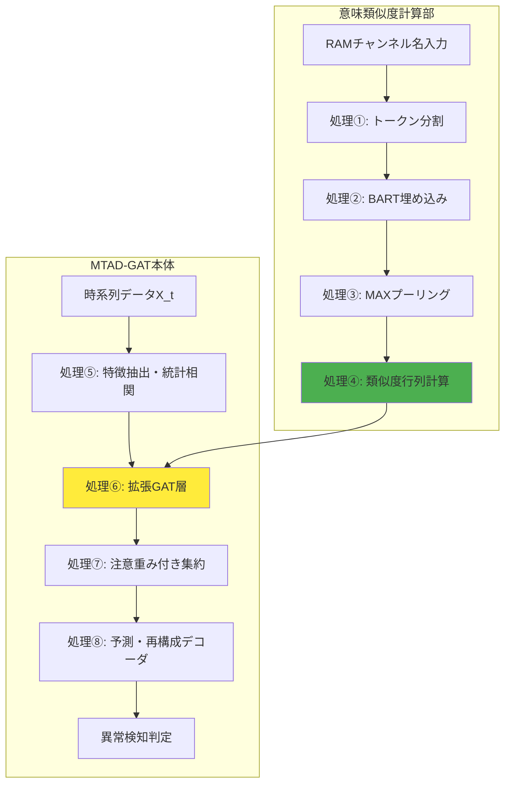

# MTAD-GATにRAM名の意味類似度を統合した異常検知手法

## 1. 技術概要

### 発明のポイント
- **MTAD-GAT**（多変量時系列異常検知）に**RAM名の意味的類似度**を統合
- **BART**による自然言語埋め込み + **コサイン類似度** + **Graph Attention機構**の融合
- チャンネル名の意味を活用した精度向上

## 2. 先行技術との関係

### ①CNNベース異常検知（先行特許）
- **課題**: 局所時系列パターンは捉えられるが、チャンネル間の意味的関係を反映できない

### ②MTAD-GATベース（自己先行出願）
- **利点**: チャンネル間の時系列相関をグラフ構造で表現
- **課題**: ラベル名の意味的関係を考慮できない
- **例**: `RAM_voltage`と`RAM_current`が意味的に近くても、統計的相関が低ければ結合されない

### ③今回の提案手法
**解決策**: ②を基盤として、統計相関と意味類似度の二重グラフ表現を実現

1. **意味的類似度の統合（チャンネル名の意味を数値化して活用）**
   - **名前を数値に変換**: `RAM_voltage`→数値ベクトルでAIが理解可能な形式に
   - **関連度を計算**: voltage↔current、power↔energyなど意味の近さを数値化
   - **注意機構に反映**: 意味が近いチャンネル同士により注意を向けるよう調整

2. **二重グラフ表現（2つのチャンネル関係を同時活用）**
   - **データから学ぶ関係**: 時系列の統計的相関（例：電圧↔電流の実測値相関）
   - **名前から分かる関係**: 意味的類似度（例：voltage↔powerの語彙的関連）
   - **両方を組み合わせ**: データ相関＋意味関係で頑健な異常検知を実現

## 3. 技術実装

### 全体アルゴリズム（MTAD-GATへの統合）


### MTAD-GAT統合アーキテクチャ
```
従来MTAD-GAT:
時系列データ → 特徴抽出 → GAT層 → デコーダ → 異常検知

提案手法（拡張MTAD-GAT）:
時系列データ → 特徴抽出 ↘
                        → 拡張GAT層 → デコーダ → 異常検知
チャンネル名 → 意味埋め込み ↗
              (類似度行列)
```

### 各処理の詳細説明

#### 処理①: トークン分割
```
入力: RAM_voltage, RAM_current, temperature
出力: ["RAM", "_vol", "tage"], ["RAM", "_current"], ["temperature"]
処理: tokens = BARTTokenizer(RAM_i)
```
- BARTTokenizerによりチャンネル名を意味単位に分割
- チャンネルごとに異なるトークン数を生成
- 例：`RAM_voltage`→3トークン、`RAM_speed`→2トークン、`temperature`→1トークン

#### 処理②: BART埋め込み
```
入力: 各トークンリスト
出力: トークン埋め込み行列 [seq_len × 768次元]
処理: token_embeddings = BARTEncoder(tokens)
```
- 各トークンを768次元の意味ベクトルに変換
- BART事前学習済みモデルの知識を活用

#### 処理③: MAXプーリング
```
入力: 可変長トークン埋め込み
出力: 固定長チャンネル埋め込み e_i [768次元]
処理: e_i = MaxPooling(token_embeddings)
```
- 各次元で最大値を選択して固定長ベクトルに統一
- 全チャンネルが同じサイズで類似度計算可能に
- **トークン分割問題の解決**: 異なる長さのトークンを同一サイズに統一

#### 処理④: 類似度行列計算
```
入力: 固定長チャンネル埋め込み e_i, e_j
出力: 意味類似度行列 S [N×N]
処理: S_ij = cos(e_i, e_j) = (e_i^T × e_j) / (||e_i|| × ||e_j||)
```
- 全チャンネル間のペアワイズ意味類似度を計算
- N×N対称行列として意味的関係グラフを構築

#### 処理⑤: 特徴抽出・統計相関（MTAD-GAT標準処理）
```
入力: 多変量時系列データ X_t [T×N]
出力: ノード特徴 H [N×d], 統計相関行列 A^(time) [N×N]
処理: H = FeatureExtractor(X_t)  # 各チャンネルの特徴抽出
      A_ij^(time) = Correlation(X_i, X_j)  # 時系列相関
```
- MTAD-GATの標準的な特徴抽出処理
- 時系列データから各チャンネルの特徴表現を生成
- チャンネル間の統計的相関を計算

#### 処理⑥: 拡張GAT層（意味類似度統合）
```
入力: ノード特徴 H, 統計相関 A^(time), 意味類似度 S^(sem)
出力: 拡張注意重み α_ij
処理: # 従来のGAT注意計算
      ℓ_ij^(stat) = LeakyReLU(a^T[W_h h_i || W_h h_j])
      # 提案：意味類似度バイアス追加
      ℓ'_ij = ℓ_ij^(stat) + λ×A_ij^(time) + τ×S_ij^(sem)
      α_ij = softmax_j(ℓ'_ij)
```
- **MTAD-GATのGAT層を拡張**
- 従来の統計的注意に意味類似度を統合
- λ、τで統計相関と意味関係のバランス調整

#### 処理⑦: 注意重み付き集約（MTAD-GAT標準処理）
```
入力: ノード特徴 H, 拡張注意重み α_ij
出力: 集約特徴 H' [N×d]
処理: h_i' = Σ_j α_ij × h_j  # 注意重み付き近隣集約
```
- MTAD-GATの標準的な特徴集約処理
- 拡張された注意重みで近隣チャンネル情報を統合

#### 処理⑧: 再構成デコーダ（MTAD-GAT標準処理）
```
入力: 集約特徴 H' [N×d]
出力: 再構成値 X̂_t
処理: X̂_t = ReconstructDecoder(H')
```
- MTAD-GATの標準的な再構成デコード処理
- 集約された特徴から元の時系列を再構成

## 4. 技術的効果

### 主要効果
1. **欠損耐性向上**: 意味類似度により関連チャンネルから情報補完
2. **新規チャンネル対応**: 名前解析により既存モデルで即座統合
3. **ノイズ軽減**: 意味フィルタリングによる偶然相関除去
4. **解釈可能性**: 物理的関係に基づく異常原因説明

### 応用領域
- 自動車ECU・RAMログ監視
- 産業プラント設備監視
- ITシステムメトリクス異常検知
- IoTセンサーネットワーク監視

## 5. 特許性評価

### 開発のポイント
- **新規な技術組合せ**: 「異常検知×時系列×RAM名ベクトル類似度」の独創的統合
- **言語モデル活用**: BARTなどの自然言語モデルをAttentionバイアスに応用する革新的構成
- **意味ベクトル利用**: 単純なone-hotではなく、自然言語由来の高次元意味表現を活用
- **二重グラフ融合**: 統計相関と意味類似度の相互補完による技術的優位性
- **欠損補完機能**: 関連性強化と情報補完による明確な技術的効果

### 効果
- 自動車ECU・RAMログ監視システム
- 産業プラント設備監視システム
- ITシステムメトリクス異常検知
- IoTセンサーネットワーク監視
- 幅広い監視システムへの適用可能性

## 6. 出願戦略

### 請求項構成
**主請求項**: 「多変量時系列データの各チャンネル名を自然言語モデルにより埋め込み、得られた類似度をGraph Attention Networkの注意重みに組み込む異常検知方法」

**従属請求項**: 
- BARTエンコーダ使用
- コサイン類似度計算
- Top-k疎化適用
- 平均プーリング処理

### 優先権・国際展開
- 国内優先権活用（1年以内）
- PCT出願によるパリ条約優先権
- 主要国への段階的移行

---

## まとめ

本発明は、従来のCNNベース・MTAD-GATベースの限界を克服し、**チャンネル名の意味情報をGraph Attentionに統合**する革新的異常検知手法である。統計相関と意味類似度の二重グラフ表現により、頑健で解釈可能な異常検知を実現し、特許性・産業応用性ともに高い価値を持つ。